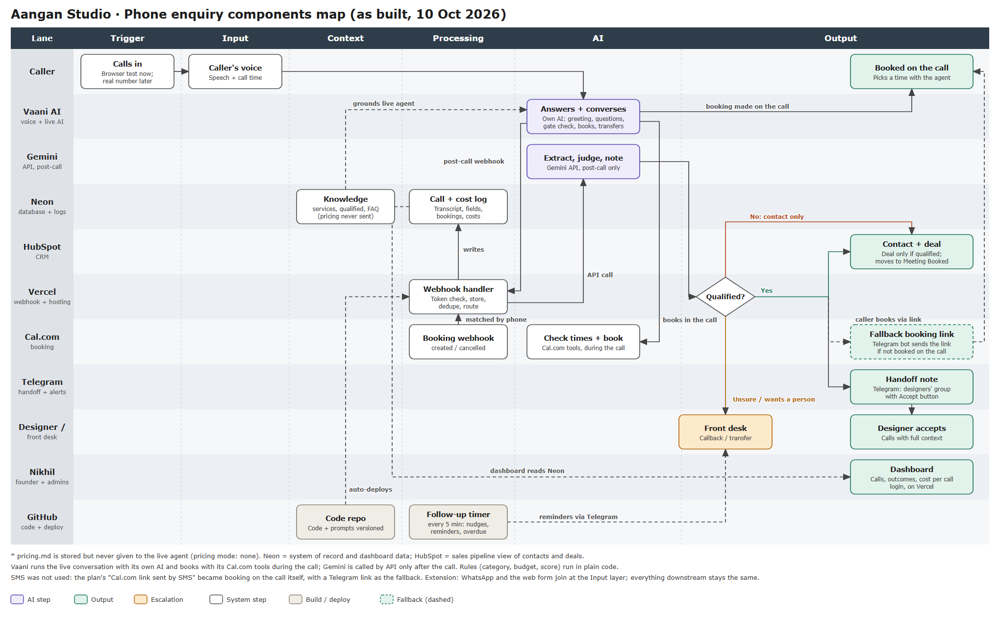

# Aangan Studio: AI phone enquiry agent

Aangan Studio is a 60-person interior design studio in Pune with about 200 enquiries a month. Roughly 48% get no reply within 48 hours, and a third arrive outside 10am to 7pm. This project is an **AI voice agent that answers every inbound call, day or night**, decides whether the caller is worth a designer's time using the founder's own five rules, books a consultation during the call, and gives the studio a dashboard of volume, outcomes and cost.

- **Live dashboard (public demo view, sample data):** https://aangan-studio-iota.vercel.app
- **Architecture, as built:** [docs/as-built-swimlane.png](docs/as-built-swimlane.png)
- **Every assumption and decision, in order:** [DECISIONS.md](DECISIONS.md) (67 entries)



## How one call works

1. The caller reaches **Vaani AI**, which runs the whole live conversation with its own speech and language models. The greeting says it is an AI assistant and that the call is recorded.
2. The agent follows [`prompts/vaani_agent.md`](prompts/vaani_agent.md): it asks one question at a time, never asks about budget, never quotes a price, and runs a **gate check** (real project? Pune or PCMC? workable timeline? an owner involved? a sensible budget?) before any booking.
3. For a good fit it checks free times and **books the consultation on the call** through Vaani's Cal.com tools. If the caller is upset or asks for a person, it transfers the call to the front desk.
4. When the call ends, Vaani posts events to `/api/webhooks/vaani/events`. The app checks the secret token, stores the caller, call and transcript in **Neon**, ignores duplicates, and merges repeat calls from one number within 60 minutes.
5. **Gemini** (after the call only) extracts the facts and judges four of the five criteria. Plain code then applies the founder's boundary rules, decides the budget criterion, derives the category (qualified, not qualified, unsure), and builds the handoff note.
6. **Qualified:** the designers' Telegram group gets the handoff note with an **Accept** button; **HubSpot** gets a contact and a deal (moved to "Meeting Booked" if the call booked a slot). **Not qualified:** a HubSpot contact only. **Unsure, a complaint, a missed call, a doubtful budget or owner:** an alert in the front-desk Telegram chat.
7. If the caller did not book on the call, a **Telegram bot** can send the Cal.com link (the caller presses Start and shares their number), and a timer nudges the front desk if they never do.
8. A **Cal.com webhook** records bookings and cancellations, matched to the enquiry by phone number. The **dashboard** reads everything from Neon.

SMS is not used anywhere. The plan's "link sent by SMS" became booking on the call, with Telegram as the fallback.

## What it runs on

| Tool | Job |
|---|---|
| Vaani AI | Answers the call, converses, books, transfers. Posts post-call events. |
| Gemini (`gemini-3.8-flash`) | After the call only: extract facts, judge criteria. |
| Neon (Postgres) | System of record: callers, calls, transcripts, enquiries, handoffs, bookings, escalations, costs, settings. |
| Vercel | Hosts the Next.js app: webhooks, the follow-up endpoint, the dashboard. |
| Telegram | Designer handoff with Accept, front-desk alerts, caller booking-link fallback. |
| Cal.com | Booking, with a webhook for created and cancelled bookings. |
| HubSpot | Contacts and deals (sales pipeline view). |
| GitHub | Code and prompts; pushes to `main` deploy to Vercel; an Actions timer runs the follow-ups every 5 minutes. |

## Repository map

```
prompts/vaani_agent.md      the agent's instructions (versioned); prompts/vaani_faq.json approved answers
data/services.md, qualified.md   the studio's own documents (pricing.md is never sent to the live agent)
db/migrations/              the database schema, applied in order with `npm run migrate`
src/app/api/webhooks/       vaani/events, vaani/call-ended (signed, for text channels), telegram, calcom
src/app/api/cron/followups  nudges, reminders, overdue handoffs (called by the GitHub timer)
src/app/dashboard/          overview, calls, call detail, follow-ups, costs, account
src/lib/pipeline/           store, dedupe, merge, cost calculation, handoff note
src/lib/scoring/            the five-criteria rules (plain code, unit-tested)
src/lib/ai/                 Gemini prompts, extraction and judging
src/lib/{notify,telegram,crm,calcom,voice,vaani}/   integrations
src/lib/agent-sim/          37 pretend callers and their rule checks
scripts/                    setup, sync, evaluation and clean-up commands
tests/                      102 automated tests
docs/                       architecture, extending, privacy notes, research
```

## Setup from scratch

You need accounts on GitHub, Vercel, Neon, Vaani AI, HubSpot, Cal.com, Telegram (a bot from @BotFather), and a Google AI Studio key for Gemini.

1. **Clone and install:** `npm install`. Copy `.env.example` to `.env.local` and fill it in (never commit it).
2. **Database:** create a Neon project, put its pooled connection string in `DATABASE_URL`, then run `npm run migrate` and `npm run seed:knowledge`.
3. **Telegram:** create a bot, create two groups (designers, front desk), add the bot as admin, put the token in `TELEGRAM_BOT_TOKEN`, send a message in each group, then run `npm run telegram:setup`. It finds the group ids and generates the secrets.
4. **HubSpot:** create a service key with contact and deal read/write, put it in `HUBSPOT_PRIVATE_APP_TOKEN`, rename two pipeline stages to "New Qualified Enquiry" and "Meeting Booked", then run `npm run hubspot:setup -- "New Qualified Enquiry" "Meeting Booked"`.
5. **Cal.com:** create an event type, require a phone number on its booking form, set `CALCOM_BOOKING_URL`, and add a webhook to `https://<your-app>/api/webhooks/calcom` (events: created, rescheduled, cancelled) using `CALCOM_WEBHOOK_SECRET`.
6. **Deploy:** import the repo into Vercel, add the same environment variables, then run `npm run telegram:setup -- webhook https://<your-app>`.
7. **Vaani:** create a Vaani API key (choose a long expiry), put it in `VAANI_API_KEY`, run `npm run vaani:create` for a clean agent, put its id in `VAANI_AGENT_ID`, connect Cal.com under Integrations, switch on the tools `Check_availability_booking`, `book_appointment` and `transfer_call` (with the front desk's number), then run `npm run vaani:sync`. Add a webhook in Vaani pointing to `https://<your-app>/api/webhooks/vaani/events?token=<VAANI_WEBHOOK_SECRET>` with the call-started, transfer, call-ended and post-processing events.
8. **Dashboard login:** `echo "a-long-password" | npm run admin:set -- you@example.com "Your Name" --temporary`. For a public evaluator view with no login, set `DASHBOARD_PUBLIC_DEMO=true` in Vercel (off by default; read-only, phone numbers masked).
9. **Follow-up timer:** add the workflow in [`docs/followups-workflow.yml`](docs/followups-workflow.yml) as `.github/workflows/followups.yml`, with repository secrets `APP_URL` and `CRON_SECRET`.

Never click **Save Agent** in Vaani's dashboard after a sync: its page can overwrite the pushed instructions. Change instructions in `prompts/vaani_agent.md` and run `npm run vaani:sync`.

## Settings

Behaviour lives in the database `config` table and `.env`, not in code. The main keys: `PRICING_MODE` (`none`; owner-controlled), `MIN_LEAD_WEEKS` (6), `MERGE_WINDOW_MINUTES` (60), `BUDGET_FLOOR_PCT` and `BUDGET_FLOORS`, `BUDGET_MISMATCH_ACTION` (`front_desk`), `TELEGRAM_NUDGE_MINUTES` (10), `OVERDUE_HANDOFF_MINUTES` (120), `RETENTION_RECORDING_DAYS` (90), `RETENTION_TRANSCRIPT_DAYS` (365), office hours (10 to 19 IST), and `ALLOW_UNKNOWN_CALLERS` (demo mode, see below). Unit prices for the cost dashboard are the `COST_*` variables.

## Commands

`npm run dev` · `npm test` (102 tests) · `npm run eval` (the 40 real enquiries through extraction and scoring, writes a CSV and summary to `eval/out/`) · `npm run agent:sim` (37 pretend callers against the agent's instructions) · `npm run e2e` (a signed mock call to a deployed app) · `npm run vaani:sync` · `npm run migrate` · `npm run cleanup:tests` (removes test data).

## How it was tested

- **102 automated tests:** scoring rules, idempotency, merging, cost maths, signatures, the booking flows, the dashboard's date logic and login.
- **Evaluation of the 40 real enquiries (September 2026):** all ran through the real Gemini pipeline: 17 qualified, 8 not qualified, 15 for a person to look at. The system agreed with the author's provisional labels on 34 of 40. Those labels are not ground truth: **a sample still needs hand-labelling** (see `eval/out/`).
- **Live, end to end:** real Vaani browser calls produced stored transcripts, scores, designer handoffs and costs; a real Cal.com booking was matched, announced and moved the HubSpot deal to "Meeting Booked"; the Accept button recorded who took a handoff.
- **Agent simulation:** 37 pretend callers (from the 40 enquiries plus edge cases) played against the agent's instructions with checks for booking, transfer, prices, tool names, re-asking and invention. The original instructions passed 10 of 37 calls; after rewriting them as a decision flow, **92 of 111 (83%)** pass, and 27 of the 37 callers pass every time. The test brain is a small Gemini model standing in for Vaani's own, so this is an estimate, not a guarantee.

## Estimated monthly cost at 200 calls

Assumptions: about 4.5 to 5.5 minutes per call, Vaani's estimate of **₹4.92 per minute**, Gemini at **US$0.75 per million input and US$3.75 per million output tokens** (an introductory rate until 31 December 2026, double afterwards, per third-party price trackers: check [Google's pricing page](https://ai.google.dev/gemini-api/docs/pricing)), measured at about 3,200 input and 2,300 output tokens per enquiry, and ₹88 to the US dollar.

| Line | Per month |
|---|---|
| Vaani call minutes (200 × 4.5 to 5.5 min × ₹4.92) | ₹4,430 to ₹5,410 |
| Gemini scoring (about ₹1 per call) | about ₹200 (about ₹400 from January 2027) |
| Phone number, if bought (a Vobiz number is ₹500 to ₹999 a month) | ₹0 now (browser tests), ₹500 to ₹999 live |
| Neon, HubSpot, Cal.com, GitHub, Telegram | ₹0 on free plans |
| Vercel | ₹0 on Hobby (non-commercial); about US$20 (about ₹1,760) on Pro for commercial use |
| **Total** | **about ₹4,650 to ₹5,600 without a number; about ₹5,150 to ₹6,600 with one; about ₹6,900 to ₹8,400 with Vercel Pro too** |

That is roughly **₹23 to ₹28 per call** in running costs. If about 43% of enquiries qualify (as in the evaluation), that is about **₹55 to ₹65 per qualified lead** before fixed plans. The dashboard's Costs page shows the real figures once the unit prices are set.

## Privacy and compliance

The greeting discloses the AI and the recording. Phone numbers are masked in lists and logs, passwords are stored as salted hashes, secrets live only in environment variables, and retention periods are configurable (90 days for recordings, 12 months for transcripts). Points that need a human decision under India's DPDP Act are listed in [docs/dpdp.md](docs/dpdp.md). That file is not legal advice.

## Known limits

- **Agent quality is good, not perfect.** About 83% of simulated calls pass. The main weakness is occasionally re-asking something the caller already said. Replies can be slow in browser tests.
- **Languages:** the agent listens and speaks English by default; Hindi and Marathi are handled only through auto-detect and are weak. Vaani's dashboard allows one language per agent.
- **No real phone number yet.** Testing used Vaani's browser calls. With `ALLOW_UNKNOWN_CALLERS` on (demo mode), those calls get a made-up `+915000…` number. **Switch it off before real callers.**
- **Vaani gives the agent no clock.** The agent cannot know the time or today's date, so it never applies office hours; a transfer that nobody answers falls back to a callback promise and an urgent front-desk alert.
- **Vaani's webhook is not signed** (the secret token in the URL is the safeguard) and its post-call event carried no call length in tests, so length is derived from the transcript's clock times.
- **Not built:** automatic retries with a last-resort alert for every failure path, the job that deletes old recordings and transcripts (the settings exist), and a GitHub check that runs the agent simulation on every change (the workflow is in `docs/agent-sim-workflow.yml`, waiting to be added).
- **Open questions for the studio:** whether the consultation is free (the agent says a designer will explain), and whether commercial spaces below a certain size are declined.
- **Test data:** the dashboard currently shows sample calls only. `DASHBOARD_PUBLIC_DEMO=true` exposes transcripts to anyone with the link, so it must be removed before real data.

## Extending to WhatsApp and the web form

The pipeline from the webhook onwards is channel-agnostic. See [docs/extending.md](docs/extending.md).
